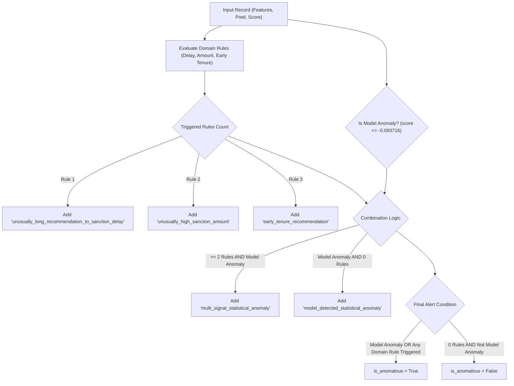

# Explainable Anomaly Rule Engine — Technical Specification

**Project:** SIH 2026 — Problem Statement SIH26102 (MoSPI)  
**Lead:** Person 1 (Financial AI / Anomaly Detection Engine)  
**Module:** `ml_modules/financial/anomaly_rules.py`  
**Date:** 2026-08-23  

---

## 1. Purpose

The **Explainable Anomaly Rule Engine** provides a transparent, deterministic interpretation layer that bridges machine learning anomaly detection (Isolation Forest) with domain-specific government expenditure rules.

While the Isolation Forest identifies multi-dimensional statistical outliers in high-dimensional space, black-box decision function scores are not directly actionable for MoSPI audit officers. The Rule Engine maps both statistical anomaly scores and individual feature values to human-readable explanation tags, ensuring that every alert generated by the system is fully auditable, interpretable, and reproducible.

---

## 2. Available Signals

The Rule Engine operates strictly on the 3 feature signals available in the official dataset snapshot for the Works Sanctioned population (73,789 records):

| Signal Name | Source Column(s) | Type | Unit / Scale | Description |
| :--- | :--- | :--- | :---: | :--- |
| `sanction_amount` | `sanction_amount` | Numerical | INR (₹) | Approved project cost (or derived via `expm1(log1p_sanction_amount)`). |
| `rec_to_sanc_days` | `sanction_date − recommendation_date` | Numerical | Days | Total administrative delay from MP recommendation to formal sanction. |
| `days_since_tenure_start` | `recommendation_date − tenure_start_date` | Numerical | Days | Time elapsed between MP tenure start and project recommendation date. |

> [!IMPORTANT]
> **Absent Fields Notice:** The current dataset snapshot does NOT contain `funds_released`, `expenditure`, `physical_progress_pct`, `pfms_status`, or `transaction_type`. The Rule Engine does NOT evaluate or simulate these missing fields.

---

## 3. Rule Definitions

The Rule Engine implements 4 standardized rules:

| Rule Name / Identifier | Output String Key | Trigger Condition | Severity & Scope |
| :--- | :--- | :--- | :--- |
| **Rule 1: Unusually Long Administrative Delay** | `"unusually_long_recommendation_to_sanction_delay"` | `rec_to_sanc_days > delay_threshold_days` (Default: `286` days) | Domain Rule (Independent alert trigger) |
| **Rule 2: Unusually High Sanction Amount** | `"unusually_high_sanction_amount"` | `sanction_amount > sanction_amount_threshold_inr` (Default: `₹11,98,014`) | Domain Rule (Independent alert trigger) |
| **Rule 3: Early-Tenure Recommendation** | `"early_tenure_recommendation"` | `days_since_tenure_start < early_tenure_threshold_days` (Default: `113` days) | Domain Rule (Independent alert trigger) |
| **Rule 4: Multi-Signal Anomaly** | `"multi_signal_statistical_anomaly"` | `len(triggered_domain_rules) >= 2` AND `is_model_anomaly` | Compound Rule (Multi-dimensional flag) |
| **Model Anomaly Baseline** | `"model_detected_statistical_anomaly"` | `is_model_anomaly` is True AND `len(triggered_domain_rules) == 0` | ML Fallback (Single statistical outlier) |

---

## 4. Threshold Methodology

All rule thresholds are empirically grounded in the exploratory data analysis (EDA) of the 73,789 training records (Checkpoint 5) and the model evaluation (Checkpoint 7A):

### 1. Delay Threshold (`286` days)
- **Source:** Checkpoint 5 EDA IQR Outlier Analysis.
- **Formula:** $Q3 + 1.5 \times IQR = 163 + 1.5 \times (163 - 41) = 286 \text{ days}$.
- **Empirical Population:** Flags the top **5.47%** longest administrative sanction delays in the national dataset (national median = 79 days).

### 2. Sanction Amount Threshold (`₹11,98,014`)
- **Source:** Checkpoint 5 EDA IQR Outlier Analysis.
- **Formula:** $Q3 + 1.5 \times IQR = ₹5,00,000 + 1.5 \times (₹5,00,000 - ₹2,00,706) = ₹11,98,014 \text{ INR}$.
- **Empirical Population:** Flags the top **8.09%** largest project sanctions in the national dataset (national median = ₹3.01 Lakhs).

### 3. Early Tenure Threshold (`113` days)
- **Source:** Checkpoint 5 EDA Distribution Analysis.
- **Formula:** 10th percentile ($P10 = 113 \text{ days}$) of `days_since_tenure_start`.
- **Empirical Population:** Flags recommendations made within the first **3.7 months** (~100 days) of an MP taking office.

### 4. Model Score Cutoff (`-0.093716`)
- **Source:** Approved Checkpoint 7A Model Evaluation.
- **Formula:** 3.0th percentile ($P03 = -0.093716$) of raw Isolation Forest decision scores.
- **Empirical Population:** Flags the top **3.0%** (2,235 records) most isolated statistical outliers.

---

## 5. Model + Rule Combination Logic

A record is evaluated by passing its feature record, the Isolation Forest binary prediction (`1` / `-1`), and the continuous decision function score to `evaluate_record_anomalies()`.

### Alert Trigger Policy
An overall alert (`is_anomalous = True`) is triggered if **EITHER**:
1. The Isolation Forest flags the record as a statistical anomaly strictly via the approved score cutoff (`anomaly_score <= -0.093716`), **OR**
2. Any severe configured domain rule triggers (Rule 1, Rule 2, or Rule 3).

> [!NOTE]
> **Raw Model Prediction vs Approved Score Cutoff:** The raw Isolation Forest prediction (`-1` / `1`) generated during training with `contamination="auto"` (which produced a 26.31% anomaly rate) is NOT used to classify model anomalies. Model anomaly status is strictly governed by the approved 3.0% operational MVP cutoff (`score <= -0.093716`).

---

## 6. Explanation Terminology

To preserve audit integrity and prevent false accusations, all output strings strictly adhere to the project's terminology policy:

> [!CAUTION]
> **Mandatory Terminology Guidelines:**
> - Explanations MUST indicate **"statistical/project irregularity"** or **"model-detected anomaly"**.
> - NEVER use terms such as **"fraud"**, **"corruption"**, **"misuse of funds"**, or **"unauthorized expenditure"**.
> - Automated anomaly detection flags project records for **human audit review**, not criminal indictment.

---

## 7. Limitations

1. **Lack of Post-Sanction Tracking:** Because disbursal and expenditure fields are absent, the Rule Engine evaluates pre-sanction timing and amounts only. It cannot detect post-sanction fund diversion.
2. **Static Outlier Cutoffs:** Fixed IQR thresholds do not account for state-level or constituency-level cost variation (e.g. ₹15 Lakhs may be normal in urban Mumbai but anomalous in a small rural constituency).
3. **Unsupervised Foundation:** Rule triggers enhance interpretability but cannot compute probability of actual corruption without historical audit outcome labels.

---

## 8. Future Financial Rules

When additional financial tracking tables are integrated in future phases, the Rule Engine will be extended with the following rules:

1. `expenditure_exceeds_sanction`: Triggered when `expenditure > sanction_amount`.
2. `high_expenditure_low_progress`: Triggered when `expenditure / sanction_amount >= 0.80` and `physical_progress_pct <= 20%`.
3. `zero_progress_with_disbursal`: Triggered when `funds_released > 0` and `physical_progress_pct == 0%`.
4. `severe_disbursal_delay`: Triggered when `days_elapsed > 365` and `funds_released / sanction_amount < 0.25`.
