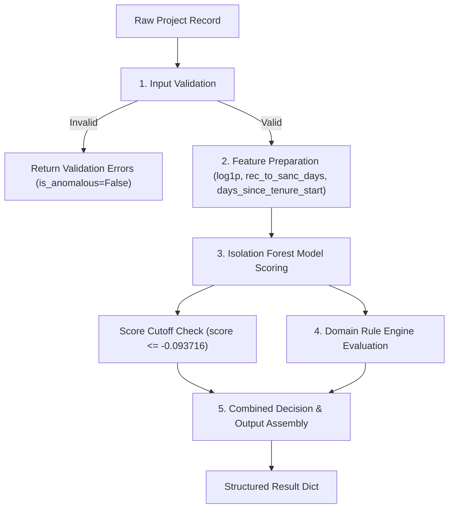

# End-to-End Financial Anomaly Inference Pipeline — Technical Specification

**Project:** SIH 2026 — Problem Statement SIH26102 (MoSPI)  
**Lead:** Person 1 (Financial AI / Anomaly Detection Engine)  
**Module:** `ml_modules/financial/inference.py`  
**Date:** 2026-08-23  

---

## 1. Pipeline Architecture

The **End-to-End Financial Anomaly Inference Pipeline** (`FinancialAnomalyInferencePipeline`) provides a single, unified interface that accepts an official MPLADS project record and returns a complete, explainable anomaly evaluation.

The pipeline orchestrates 5 modular components without duplicating model training or rule definitions:



---

## 2. Input Schema

The pipeline accepts a single project record formatted as a Python `dict` or `pandas.Series`.

| Field Name | Type | Required? | Description |
| :--- | :--- | :---: | :--- |
| `sanction_amount` | float / int | **YES** | Sanctioned project amount in INR (must be > 0). Can also pass `log1p_sanction_amount`. |
| `recommendation_date` | str / datetime | **YES** | MP project recommendation date (e.g. `'YYYY-MM-DD'`). |
| `sanction_date` | str / datetime | **YES** | District Authority sanction date (e.g. `'YYYY-MM-DD'`). |
| `tenure_start_date` | str / datetime | **YES** | Start date of MP Lok Sabha tenure (e.g. `'YYYY-MM-DD'`). |
| `work_recommendation_dtl_id` | str / int | Optional | Unique lifecycle recommendation ID (used as `project_identifier`). |
| `work_id` / `project_id` | str / int | Optional | Secondary identifier fallbacks. |

---

## 3. Validation

Input validation is performed by `validate_inference_record()` before feature extraction or ML inference:

1. **Existence Check:** Verifies presence of financial amount and all 3 required date fields.
2. **Numeric Boundaries:** Enforces `sanction_amount > 0` for non-zero ratio stability.
3. **Date Parseability:** Validates ISO date formats using `pd.to_datetime`.
4. **Rejection Policy:** If any structural errors occur, `is_anomalous` defaults to `False`, `anomaly_score` returns `None`, and error messages populate `validation_errors`.

---

## 4. Feature Preparation

For valid records, the pipeline derives the exact 3-feature vector expected by the Isolation Forest:

$$\vec{X} = \begin{bmatrix} \text{log1p\_sanction\_amount} & \text{rec\_to\_sanc\_days} & \text{days\_since\_tenure\_start} \end{bmatrix}$$

- **`log1p_sanction_amount`** $= \ln(1 + \text{sanction\_amount})$
- **`rec_to_sanc_days`** $= \text{sanction\_date} - \text{recommendation\_date} \text{ (days)}$
- **`days_since_tenure_start`** $= \text{recommendation\_date} - \text{tenure\_start_date} \text{ (days)}$

Feature column order is strictly verified against `FEATURE_NAMES` stored in `models/financial_isolation_forest.pkl`.

---

## 5. Model Inference

- **Model Artifact:** `models/financial_isolation_forest.pkl` (200 isolation trees, seed=42).
- **Decision Score:** Continuous score computed via `model.decision_function(X)` (lower/negative = more isolated).
- **Diagnostic Prediction:** Raw sklearn prediction (`-1` / `1`) stored ONLY in `model_prediction_for_diagnostics`.

---

## 6. Rule Evaluation

The derived feature record and continuous score are passed to `evaluate_record_anomalies()` in `ml_modules/financial/anomaly_rules.py`:

- **Rule 1 (Long Delay):** `rec_to_sanc_days > 286`
- **Rule 2 (High Sanction):** `sanction_amount > ₹11,98,014`
- **Rule 3 (Early Tenure):** `days_since_tenure_start < 113`
- **Rule 4 (Multi-Signal):** $\ge 2$ domain rules AND `anomaly_score <= -0.093716`

---

## 7. Final Decision Logic

The final model anomaly classification relies **STRICTLY** on the approved Checkpoint 7A score cutoff:

$$\text{is\_model\_anomaly} \iff \text{anomaly\_score} \le -0.093716$$

Raw `contamination="auto"` predictions (`-1` / `1`) are **NOT** used for the final decision.

An overall alert (`is_anomalous = True`) triggers if `is_model_anomaly` is `True` **OR** any domain rule triggers.

---

## 8. Output Schema

The pipeline returns a clean Python `dict`:

```json
{
    "project_identifier": "string",
    "is_anomalous": bool,
    "anomaly_features": ["list", "of", "strings"],
    "anomaly_score": float,
    "model_prediction_for_diagnostics": int,
    "feature_values": {
        "sanction_amount": float,
        "log1p_sanction_amount": float,
        "rec_to_sanc_days": float,
        "days_since_tenure_start": float
    },
    "validation_errors": [],
    "validation_warnings": [],
    "variance_amount_inr": null
}
```

---

## 9. Missing Financial Signals

The official MoSPI dataset snapshot does NOT contain post-sanction execution fields:
- `expenditure`
- `funds_released`
- `physical_progress_pct`
- `pfms_status`
- `transaction_type`

These fields are omitted from feature engineering and rule evaluation.

---

## 10. Variance Limitation

> [!IMPORTANT]
> **Critical Variance Rule:**
> `variance_amount_inr` is explicitly set to `None`.
> Because expenditure data is absent, financial over-runs or under-spending (`sanction_amount - expenditure`) CANNOT be calculated.
> Using `sanction_amount - 0` or synthetic subtractions is strictly prohibited. `variance_amount_inr` will become calculable when actual expenditure audit logs are integrated.

---

## 11. Example Normal Result

```json
{
    "project_identifier": "10001",
    "is_anomalous": false,
    "anomaly_features": [],
    "anomaly_score": 0.048512,
    "model_prediction_for_diagnostics": 1,
    "feature_values": {
        "sanction_amount": 300000.0,
        "log1p_sanction_amount": 12.61154,
        "rec_to_sanc_days": 80.0,
        "days_since_tenure_start": 366.0
    },
    "validation_errors": [],
    "validation_warnings": [],
    "variance_amount_inr": null
}
```

---

## 12. Example Anomaly Result

```json
{
    "project_identifier": "139500",
    "is_anomalous": true,
    "anomaly_features": [
        "unusually_long_recommendation_to_sanction_delay",
        "unusually_high_sanction_amount",
        "early_tenure_recommendation",
        "multi_signal_statistical_anomaly"
    ],
    "anomaly_score": -0.237589,
    "model_prediction_for_diagnostics": -1,
    "feature_values": {
        "sanction_amount": 5000000.0,
        "log1p_sanction_amount": 15.42494,
        "rec_to_sanc_days": 693.0,
        "days_since_tenure_start": 94.0
    },
    "validation_errors": [],
    "validation_warnings": [],
    "variance_amount_inr": null
}
```
